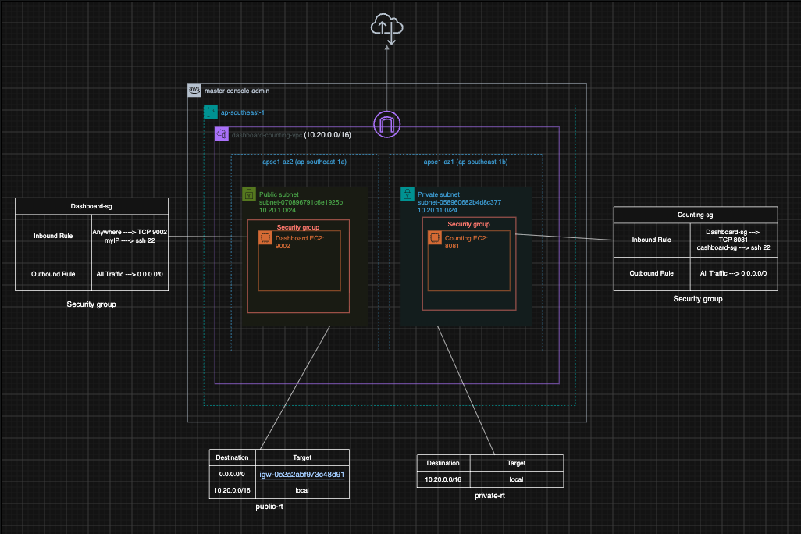

# AWS VPC Infrastructure Setup Guide

##  Architecture Overview

* **Region**: `ap-southeast-1` (Singapore)
* **VPC**: `dashboard-counting-vpc` (`10.20.0.0/16`)
* **Subnets**:
  * **Public Subnet**: `subnet-070896791c6e1925b` (`10.20.1.0/24`) in `ap-southeast-1a`
  * **Private Subnet**: `subnet-058960682b4d8c377` (`10.20.11.0/24`) in `ap-southeast-1b`
* **Components**:
  * **Internet Gateway**: `igw-0e2a2abf973c48d91`
  * **Dashboard EC2 Instance**: Publicly accessible on TCP port `9002`
  * **Counting EC2 Instance**: Internal service on TCP port `8081`

---

##  Step-by-Step Deployment Guide

### Step 1: Create the VPC
1. Open the **AWS Management Console** and navigate to **VPC**.
2. Click **Create VPC**.
3. Configure the following settings:
   * **Name tag**: `dashboard-counting-vpc`
   * **IPv4 CIDR block**: `10.20.0.0/16`
4. Click **Create VPC**.

---

### Step 2: Create Subnets
1. Go to **Subnets** > **Create subnet**.
2. Select `dashboard-counting-vpc`.

#### **Public Subnet**
* **Subnet name**: `Public subnet`
* **Availability Zone**: `ap-southeast-1a`
* **IPv4 CIDR block**: `10.20.1.0/24`

#### **Private Subnet**
* **Subnet name**: `Private subnet`
* **Availability Zone**: `ap-southeast-1b`
* **IPv4 CIDR block**: `10.20.11.0/24`

---

### Step 3: Configure Internet Gateway & Route Tables

#### **1. Internet Gateway (IGW)**
1. Go to **Internet Gateways** > **Create internet gateway**.
2. Name: `dashboard-counting-igw` and create.
3. Select the created IGW, click **Actions** > **Attach to VPC**, and choose `dashboard-counting-vpc`.

#### **2. Public Route Table (`public-rt`)**
1. Go to **Route Tables** > **Create route table**.
2. Name: `public-rt` | VPC: `dashboard-counting-vpc`.
3. Select `public-rt` > **Routes** > **Edit routes**:
   * Add Route: `0.0.0.0/0` ➔ Target: `igw-0e2a2abf973c48d91`
   * Local Route: `10.20.0.0/16` ➔ `local`
4. Go to **Explicit subnet associations** > **Edit subnet associations** and select **Public subnet**.

#### **3. Private Route Table (`private-rt`)**
1. Create route table named `private-rt` in `dashboard-counting-vpc`.
2. Ensure routes contain only local traffic:
   * Local Route: `10.20.0.0/16` ➔ `local`
3. Associate with **Private subnet**.

---

### Step 4: Configure Security Groups

#### **1. Dashboard Security Group (`Dashboard-sg`)**
* **Inbound Rules**:
  * **TCP 9002**: Source `Anywhere` (`0.0.0.0/0`)
  * **SSH (22)**: Source `myIP`
* **Outbound Rules**:
  * **All Traffic**: Destination `0.0.0.0/0`

#### **2. Counting Security Group (`Counting-sg`)**
* **Inbound Rules**:
  * **TCP 8081**: Source `Dashboard-sg` (Security Group ID reference)
  * **SSH (22)**: Source `Dashboard-sg` (for bastion/jump box connectivity)
* **Outbound Rules**:
  * **All Traffic**: Destination `0.0.0.0/0`

---

### Step 5: Launch Compute Instances

#### **1. Dashboard EC2**
* **Subnet**: Public Subnet (`10.20.1.0/24`)
* **Auto-assign Public IP**: Enable
* **Security Group**: Assign `Dashboard-sg`
* **Port Configuration**: App runs on TCP `9002`

#### **2. Counting EC2**
* **Subnet**: Private Subnet (`10.20.11.0/24`)
* **Auto-assign Public IP**: Disable
* **Security Group**: Assign `Counting-sg`
* **Port Configuration**: App runs on TCP `8081`

---

##  Security Architecture Summary

